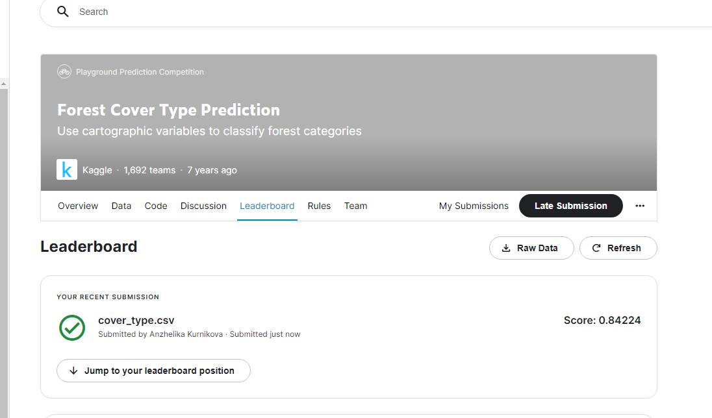
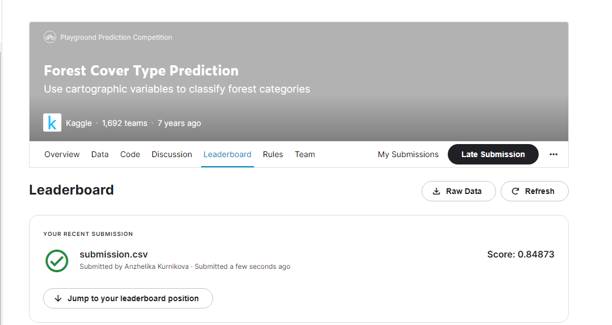

# Here I present 2 solutions

# #1 Solution is mine. I was working on it for 4 days without stops :)
Screenshot: 

Solution is in the my-tryings.ipynb file in this branch bonus-task-cover-type.

# #2 Solution is my solution with an idea I took from public kaggle about splitting my extra tree classifier

Screenshot: 

Solution is in the my-tryings_with_splitted_extra_trees.ipynb in another branch named bonus-task-2.
